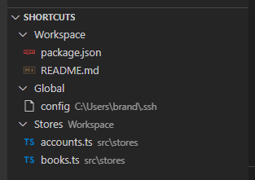

# File Shortcuts

**File Shortcuts** is an Visual Studio Code extension that allows you to save files to a shortcut menu for later access.

## Features

* Per workspace shortcuts
* Global shortcuts
* Shortcut groups
* Add shortcuts from context menus
* File icons

## Image

